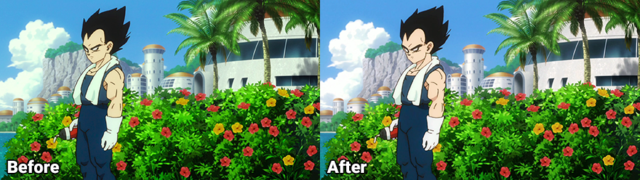

# Broly Color Correction

A small script to rip, re-encode, and color correct Dragonball Super Broly to get rid of the green tint, and lower saturation. This is by no means a perfect color correction and doesn't exactly match the MangaUK version, but it's a huge improvement over what comes with the Blu Ray.

## Prerequisites

You will need the Blu Ray of Dragonball Super Broly affected by the green tint issue, and a Blu Ray drive for your computer. You will also need the following installed and their installation directories added to your PATH environment variable:

* [MakeMKV](https://www.makemkv.com/download/)
* [Handbrake](https://handbrake.fr/downloads.php)
* [Handbrake CLI](https://handbrake.fr/downloads2.php) - I just extracted this in the same directory the Handbrake was installed in.
* [FFmpeg](https://ffmpeg.zeranoe.com/builds/) - I created a directory in Program Files called "ffmpeg" and extracted everything into there.

Once you have them installed to add them to your PATH environment variable do the following:

1. Open up the start menu and type in "env" and choose "Edit the system environment variables".
2. Click the "Environment Variables..." button.
3. Under the "System Variables" section (the lower half), find the row with "Path" in the first column and click "Edit...".
4. Assuming you installed everything in their default locations you should just to add the following:
  * C:\Program Files (x86)\MakeMKV
  * C:\Program Files\HandBrake
  * C:\Program Files\ffmpeg\bin

## Getting Started

1. Insert your Dragonball Super Broly Blu Ray into your Blu Ray drive.
2. Open up Powershell/Command Prompt.
3. Navigate to where you extract `Process.bat` and `DBSB.acv`.
4. Run `Process.bat C:\PATH_WHERE_YOU_WANT_TO_RIP_TO`. (You will need around 40GB free.)
5. It will do all the steps automatically and open the folder in explorer once it's done.
